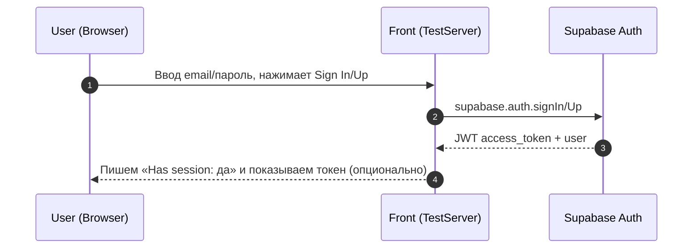
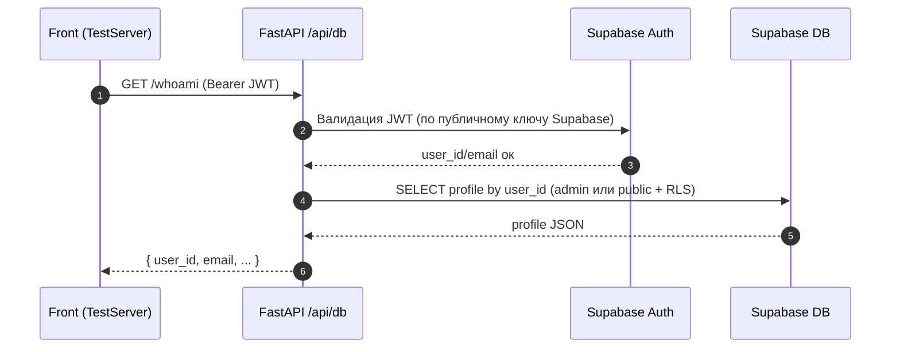
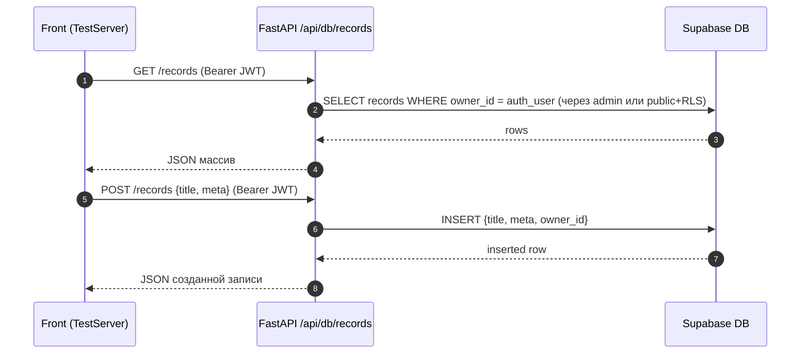

# SMART VISION — Архитектура связки: Front ↔ FastAPI ↔ Supabase (v1)

> Короткая, «долгоживущая» схема того, как сейчас устроены фронт, сервер и база. Включает основные потоки (аутентификация, профили, CRUD по `records`), переменные окружения и различия dev/prod.

---

## 1) Общая топология (контекст)

```mermaid
flowchart LR
  subgraph Browser [Frontend (TestServer page)]
    UI[TestServer HTML/JS]
  end

  subgraph API [FastAPI (Render)]
    A1[/ /health /api/testserver/ping /api/db/* /]
  end

  subgraph SB [Supabase]
    AU[(Auth)]
    DB[(Postgres + RLS)]
    ST[(Storage)]
  end

  UI -- fetch /api/... --> A1
  UI -- supabase-js --> AU
  A1 -- supabase-py (service role / anon) --> DB
```

**Идея:**
- Фронт (страница **TestServer**) работает либо локально (127.0.0.1:5500), либо на проде (test.smartvision.life).
- Сервер (FastAPI) принимает запросы `/api/...`, ходит к Supabase через серверные ключи.
- Supabase: модуль Auth (выдаёт JWT), Postgres (таблицы `profiles`, `records`, и т.д.), опционально Storage.

---

## 2) Основные переменные окружения (сервер)

| Переменная | Назначение | Пример |
|---|---|---|
| `SUPABASE_URL` | URL проекта Supabase | `https://<project>.supabase.co` |
| `SUPABASE_SERVICE_ROLE_KEY` | Серверный ключ (полный доступ, обходит RLS) | `eyJhbGciOi...` |
| `SUPABASE_ANON_KEY` *(опц.)* | Публичный ключ (необязательно на сервере) | `eyJhbGciOi...` |
| `DEV_BYPASS_AUTH` | Dev-байпас авторизации на сервере | `true/false` |
| `DEV_USER_ID`, `DEV_EMAIL` | Фиктивный пользователь в dev-режиме | UUID / email |

> На проде **`DEV_BYPASS_AUTH=false`**. Ключ `SERVICE_ROLE` храним **только на сервере**.

---

## 3) Инициализация клиентов Supabase

- **Фронт**: `supabase-js` (использует `SUPABASE_URL` + `ANON KEY`).
- **Сервер**: `supabase-py` (два клиента):
  - `public` (anon key) — для сценариев под RLS.
  - `admin` (service-role key) — для серверной логики/миграций/фоновых задач.

---

## 4) Потоки запросов (последовательности)

### 4.1 Аутентификация пользователя (Front ↔ Supabase)



**Результат:** на фронте есть `access_token`, который можно слать на сервер в `Authorization: Bearer <token>`.

### 4.2 `GET /api/db/whoami` и `GET /api/db/profiles/me`



**Примечание:** в dev с `DEV_BYPASS_AUTH=true` сервер может подставлять фиктивный `user_id/email` без JWT.

### 4.3 Мини-CRUD `records` (список и создание)



**Варианты реализации прав:**
- **А. Через `admin` (service-role)**: сервер сам фильтрует по `owner_id`, RLS можно оставить выключенным (быстрый старт).
- **Б. Через `public` + RLS**: политики БД разрешают только свои записи. Сервер не нуждается в service-role, но фронт всегда присылает валидный JWT.

---

## 5) Роуты и их назначение

| Роут | Метод | Назначение | Требует JWT | Комментарий |
|---|---|---|---|---|
| `/health` | GET | Проверка живости сервера | нет | Используется Render’ом и нами |
| `/api/testserver/ping` | GET | Технический пинг из TestServer | нет | Возвращает `{ok: true}` и метаданные |
| `/api/db/whoami` | GET | Кто я (из JWT) | да* | В dev можно через байпас |
| `/api/db/profiles/me` | GET | Текущий профиль | да* | SELECT из `profiles` |
| `/api/db/records` | GET | Список записей пользователя | да | Фильтр по `owner_id` |
| `/api/db/records` | POST | Создание записи | да | Проставляем `owner_id` |

---

## 6) Dev ↔ Prod различия

| Аспект | Dev (локально) | Prod (Render) |
|---|---|---|
| Домен фронта | `http://127.0.0.1:5500` | `https://test.smartvision.life` |
| API Base | `http://127.0.0.1:8000` (override) | относительный `/api/...` |
| Auth | можно `DEV_BYPASS_AUTH=true` | `DEV_BYPASS_AUTH=false` |
| Ключи | `.env` локально | Render → Environment |
| RLS | можно выключить | рекомендуется включить (или фильтровать на сервере) |

---

## 7) Мини-«как пользоваться» (для TestServer)

1. Ввести **Supabase URL** и **Anon key** → «Инициализировать supabase-js».
2. Sign Up/Sign In → «Получить сессию» (Has session: да).
3. Нажать:
   - «Проверить /api/testserver/ping» → `{ok:true}`.
   - «GET /api/db/whoami» и «GET /api/db/profiles/me» → должен прийти user/email.
   - «GET /api/db/records» → список.
   - «POST /api/db/records» → создание и повторный «GET».

---

## 8) Дальнейшее развитие (итеративно)

- **Про `records`**: добавить `GET/DELETE /records/{id}`, пагинацию, сортировку.
- **RLS**: включить и прописать политики (select/insert/update/delete — только свои записи).
- **Storage**: загрузка/чтение файлов, привязка к записям.
- **Observability**: логирование (structured logs), метрики, трассировка.
- **Конфиг**: вынести все ID/URL/ключи в `.env`/Render env, обеспечить секреты.

---

## 9) Ссылки на ключевые файлы (по проекту)

- `server/main.py` — подключение роутеров, CORS, статика, health.
- `server/database/supabase_client.py` — инициализация public/admin.
- `server/database/api_db.py` — whoami, profiles.
- `server/database/api_records.py` — CRUD примеры (минимум).
- `smart/testserver/` — страница, CSS, JS.

---

_Версия: v1.0. Обновлять по мере развития._

